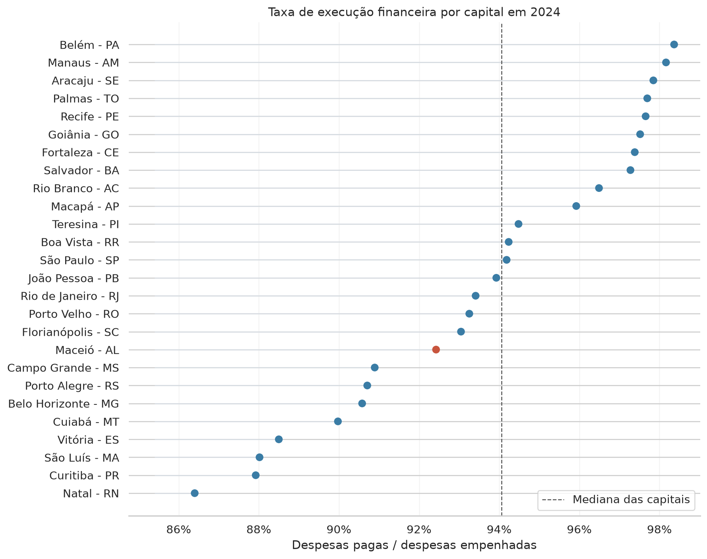
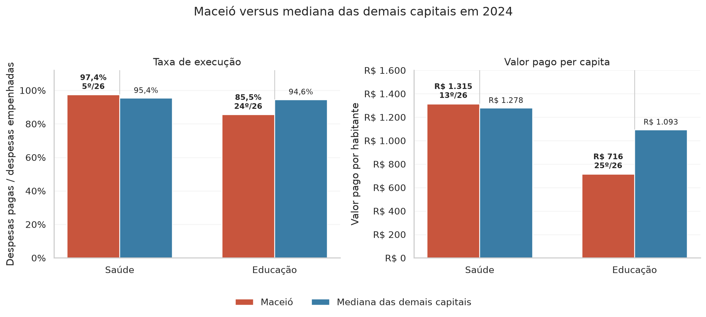
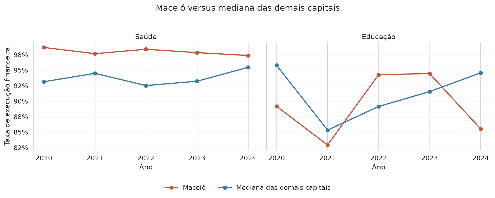

# Análise de despesas por função das capitais brasileiras

Este repositório reúne a minha solução para um desafio técnico de estágio em
análise de dados da SEFAZ-AL.

A proposta do desafio era trabalhar com dados de despesas das capitais
brasileiras, publicados no FINBRA/Siconfi, e comparar o que foi empenhado com o
que foi efetivamente pago em cada função de governo.

Eu organizei o projeto pensando em duas coisas: deixar o caminho reproduzível e
contar uma história clara a partir dos dados. Por isso, além dos scripts de
tratamento, também mantive notebooks de análise e arquivos finais em `outputs/`
com as tabelas e figuras principais.

## Visão geral

Os dados usados aqui vêm do relatório **Despesas por Função (Anexo I-E)**, no
escopo de capitais, para os anos de **2020 a 2025**.

Fonte dos dados: **FINBRA/Siconfi**, relatório **Despesas por Função (Anexo
I-E)**, escopo **Capitais**. Os arquivos brutos usados na análise são os ZIPs
fornecidos no desafio e mantidos em `dados_compactos/`.

Ambiente usado no desenvolvimento:

- Python **3.13.9**;
- processamento e última geração dos artefatos em **07/07/2026**.

A base final consolidada ficou com:

- **50.334 linhas**;
- **16 colunas**;
- anos de **2020 a 2025**;
- classificação das contas entre `função`, `subfunção`, `total` e
  `demais_subfunções`.

Um cuidado importante apareceu logo no diagnóstico: **2025 ainda está parcial**.
Enquanto os anos de 2020 a 2024 têm 26 capitais, 2025 tem apenas 11 capitais na
base. Por isso, usei **2024 como ano de referência** nas comparações principais.

## Pergunta principal

A pergunta que guiou a análise foi:

> De tudo que as capitais empenharam em cada função de governo, quanto foi
> efetivamente pago dentro do mesmo ano?

O indicador central foi a taxa de execução financeira:

```text
taxa de execução = despesas pagas / despesas empenhadas
```

Essa taxa ajuda a comparar o valor pago com o valor comprometido no orçamento.
Ela não deve ser lida, sozinha, como medida de qualidade do gasto público. Uma
taxa mais baixa pode indicar mais valores ficando para restos a pagar, mas a
interpretação depende do contexto de cada função, contrato e prefeitura.

Também usei valores per capita em alguns recortes, porque comparar capitais de
tamanhos muito diferentes apenas pelo valor total pode distorcer a leitura.

## Estrutura do repositório

```text
.
├── dados_compactos/             # ZIPs originais do desafio
├── dados_extraidos/             # CSVs extraídos por script, não versionados
├── dados_processados/
│   └── finbra_consolidado.parquet
├── notebooks/
│   ├── 01_diagnostico_dados.ipynb
│   └── 02_analise_execucao_funcoes.ipynb
├── outputs/
│   ├── figuras/
│   └── tabelas/
├── scripts/
│   ├── extrair_dados.py
│   ├── consolidar_dados.py
│   ├── validar_dados.py
│   └── gerar_outputs.py
├── Makefile
├── README.md
└── requirements.txt
```

## Como reproduzir

Crie e ative um ambiente virtual:

```bash
python -m venv .venv
source .venv/bin/activate
```

Instale as dependências:

```bash
pip install -r requirements.txt
```

Extraia os CSVs a partir dos ZIPs originais:

```bash
python scripts/extrair_dados.py
```

Consolide os dados em uma base única:

```bash
python scripts/consolidar_dados.py
```

Valide a base consolidada:

```bash
python scripts/validar_dados.py
```

Gere as tabelas e figuras finais:

```bash
python scripts/gerar_outputs.py
```

Também adicionei a opção de um comando único para reproduzir o pipeline principal:

```bash
make reproduzir PYTHON=.venv/bin/python
```

Esse comando executa extração, consolidação, validação e geração dos outputs.

Os notebooks podem ser abertos com:

```bash
jupyter lab notebooks/
```

## Pipeline de dados

O pipeline foi dividido em quatro partes principais.

1. **Extração dos ZIPs**

   O script `scripts/extrair_dados.py` percorre `dados_compactos/`, identifica
   os arquivos `.zip` e extrai cada `finbra.csv` para `dados_extraidos/{ano}/`.
   Nessa etapa, também trato o encoding original dos arquivos.

2. **Consolidação**

   O script `scripts/consolidar_dados.py` lê os CSVs extraídos, respeitando as
   particularidades do Siconfi:
   - encoding original em `latin-1`, convertido na extração;
   - separador de colunas `;`;
   - vírgula como separador decimal;
   - três linhas iniciais de metadados antes do cabeçalho real.

   Depois disso, adiciono a coluna `ano`, junto todos os anos em uma única base
   e classifico a coluna `Conta`.

3. **Base otimizada em Parquet**

   A base final é salva em
   `dados_processados/finbra_consolidado.parquet`.

   Escolhi Parquet porque ele é um formato colunar, comprimido e mais rápido de
   ler em análises repetidas. Como os notebooks usam a base consolidada várias
   vezes, isso evita reler e tratar todos os CSVs a cada nova etapa.

4. **Validação e outputs**

   O script `scripts/validar_dados.py` confere colunas, tipos, anos disponíveis,
   quantidade de capitais por ano, nulos esperados e possíveis caracteres
   quebrados.

   O script `scripts/gerar_outputs.py` materializa as tabelas e figuras finais
   usadas na leitura dos resultados.

## Cuidados importantes

Alguns cuidados foram centrais para evitar conclusões erradas.

- **2025 está incompleto.** O ano aparece com apenas 11 capitais, então ficou
  fora das comparações principais.
- **A coluna `Conta` mistura níveis diferentes.** Funções, subfunções, totais e
  linhas como `FUxx - Demais Subfunções` não podem ser somadas sem critério.
- **Totais intraorçamentários foram separados.** As contas `Despesas Exceto
Intraorçamentárias` e `Despesas Intraorçamentárias` são classificadas como
  `total`. Elas não entram nas análises por função, porque somá-las junto com
  funções ou subfunções poderia gerar dupla contagem.
- **A análise principal usa `tipo_conta == "função"`.** Isso reduz o risco de
  dupla contagem.
- **Valores per capita complementam os valores absolutos.** Eles ajudam a
  comparar capitais com populações muito diferentes.
- **Taxa de execução não é sinônimo de qualidade.** Ela mostra a relação entre
  pago e empenhado, mas não explica sozinha por que a diferença aconteceu.
- **Existem casos pontuais de taxa acima de 100%.** Na base por função,
  encontrei 10 combinações de ano, capital e função em que o valor pago ficou
  acima do empenhado. Tratei esses casos como sinais para revisão contextual,
  não como erro automático, porque podem refletir ajustes contábeis, forma de
  registro ou particularidades da declaração.

## Dicionário curto da base

| Coluna          | O que representa                                                                |
| --------------- | ------------------------------------------------------------------------------- |
| `ano`           | Exercício do arquivo FINBRA/Siconfi                                             |
| `Instituição`   | Prefeitura responsável pela declaração                                          |
| `Cod.IBGE`      | Código IBGE do município, usado para identificar a capital                      |
| `UF`            | Unidade da Federação                                                            |
| `População`     | População usada no arquivo do Siconfi                                           |
| `Coluna`        | Estágio da despesa, como empenhada ou paga                                      |
| `Conta`         | Texto original da função, subfunção ou total                                    |
| `tipo_conta`    | Classificação criada no pipeline: função, subfunção, total ou demais subfunções |
| `codigo_funcao` | Código da função orçamentária                                                   |
| `nome_funcao`   | Nome da função orçamentária                                                     |
| `Valor`         | Valor financeiro em reais                                                       |

## Indicadores usados

Usei três indicadores principais:

| Indicador                        | Como foi usado                          |
| -------------------------------- | --------------------------------------- |
| Taxa de execução financeira      | `despesas pagas / despesas empenhadas`  |
| Diferença entre empenhado e pago | Valor empenhado menos valor pago        |
| Valor pago per capita            | Despesas pagas divididas pela população |

Nos rankings, valores mais altos de taxa de execução indicam que uma proporção
maior do que foi empenhado foi paga dentro do ano. Ainda assim, a análise foi
tratada como comparação descritiva, sem afirmar causalidade.

## Principais resultados

Em 2024, as capitais com maiores taxas gerais de execução financeira foram:

| Posição | Capital      | Taxa de execução |
| ------: | ------------ | ---------------: |
|       1 | Belém - PA   |           98,37% |
|       2 | Manaus - AM  |           98,16% |
|       3 | Aracaju - SE |           97,85% |
|       4 | Palmas - TO  |           97,70% |
|       5 | Recife - PE  |           97,65% |

Maceió ficou em **18º lugar** no ranking geral das capitais em 2024, com taxa de
execução de **92,42%**.

Entre as funções, as menores taxas de execução em 2024 apareceram em:

| Posição | Função              | Taxa de execução |
| ------: | ------------------- | ---------------: |
|       1 | Agricultura         |           83,66% |
|       2 | Saneamento          |           85,26% |
|       3 | Urbanismo           |           87,77% |
|       4 | Comércio e Serviços |           88,57% |
|       5 | Gestão Ambiental    |           89,22% |

Esses resultados não significam, automaticamente, pior gestão ou melhor gestão.
Eles indicam onde a distância proporcional entre empenhado e pago foi maior e,
por isso, onde faria sentido investigar com mais contexto.



## Recorte de Maceió

Como o desafio é da Sefaz Maceió, aprofundei a leitura em Maceió, principalmente
em Saúde e Educação.

Para identificar Maceió nos filtros, usei o código IBGE **2704302**, em vez de
depender apenas do texto do nome da prefeitura.

Em **Saúde**, Maceió teve um resultado forte em 2024:

- pagou **97,36%** do que empenhou;
- ficou em **5º lugar entre as 26 capitais**;
- teve valor pago per capita levemente acima da mediana das demais capitais.

Em **Educação**, a leitura foi diferente:

- pagou **85,52%** do que empenhou;
- ficou em **24º lugar entre as 26 capitais**;
- teve valor pago per capita abaixo da mediana das demais capitais.

Essa diferença é um dos achados mais importantes da análise: Maceió aparece bem
posicionada em Saúde pela taxa de execução, mas fica entre as últimas capitais
em Educação, tanto na execução quanto no valor pago por habitante.



Também olhei rapidamente as subfunções de Saúde e Educação em Maceió. Esse
recorte entra como apoio à interpretação, não como foco principal da análise.

Além desse recorte, gerei uma tabela de Maceió por **todas as funções em 2024**.
Ela ajuda a verificar se Saúde e Educação são exceções ou se fazem parte de um
comportamento mais geral da capital.

Em 2024, as maiores concentrações do valor pago foram:

| Função   | Principal subfunção paga em Maceió               | Participação no valor pago da função |
| -------- | ------------------------------------------------ | -----------------------------------: |
| Saúde    | `10.302 - Assistência Hospitalar e Ambulatorial` |                               58,52% |
| Educação | `12.361 - Ensino Fundamental`                    |                               42,36% |



## Arquivos finais

As tabelas finais estão em `outputs/tabelas/`:

| Arquivo                                     | Conteúdo                                                                |
| ------------------------------------------- | ----------------------------------------------------------------------- |
| `ranking_capitais_2024.csv`                 | Ranking das capitais pela taxa de execução em 2024                      |
| `ranking_funcoes_2024.csv`                  | Ranking das funções pela taxa de execução em 2024                       |
| `maceio_saude_educacao_2020_2024.csv`       | Comparação de Maceió com a média e mediana das demais capitais          |
| `maceio_funcoes_2024.csv`                   | Maceió por todas as funções em 2024, com rankings por taxa e per capita |
| `maceio_subfuncoes_saude_educacao_2024.csv` | Recorte de subfunções em Saúde e Educação para Maceió                   |

As figuras finais estão em `outputs/figuras/`:

| Arquivo                                              | Conteúdo                                                      |
| ---------------------------------------------------- | ------------------------------------------------------------- |
| `ranking_capitais_taxa_execucao_2024.png`            | Ranking visual das capitais em 2024                           |
| `maceio_vs_mediana_taxa_execucao_saude_educacao.png` | Evolução da taxa de execução em Saúde e Educação              |
| `posicao_maceio_saude_educacao_2024.png`             | Comparação direta de Maceió com a mediana das demais capitais |

## Limitações

Algumas limitações ficaram no radar durante a análise.

- O ano de 2025 está parcial, então não usei esse ano para comparar desempenho
  entre capitais.
- A análise usa dados declarados ao Siconfi. Não fiz auditoria externa dos
  lançamentos.
- A taxa de execução mostra a relação entre pago e empenhado, mas não explica
  sozinha os motivos das diferenças.
- O recorte por subfunção foi usado apenas para Saúde e Educação em Maceió.
  Esse recorte poderia ser expandido em uma investigação mais longa.
- Não comparei regras locais, calendários de pagamento, restos a pagar de anos
  anteriores ou detalhes contratuais, que poderiam mudar a interpretação de
  alguns resultados.

Mesmo com essas limitações, o projeto já cumpre o objetivo central do desafio:
extrair, tratar, validar e analisar os dados de forma reproduzível, mostrando
com clareza onde Maceió se posiciona em relação às demais capitais.

## Checagens esperadas

Ao rodar `python scripts/validar_dados.py`, espero ver:

- 50.334 linhas e 16 colunas;
- anos de 2020 a 2025;
- 26 capitais de 2020 a 2024;
- 11 capitais em 2025, marcado como ano parcial;
- tipos de conta esperados: `função`, `subfunção`, `demais_subfunções` e
  `total`;
- validação específica dos totais intra/exceto, para evitar dupla contagem;
- nenhum caractere quebrado nas colunas textuais.
